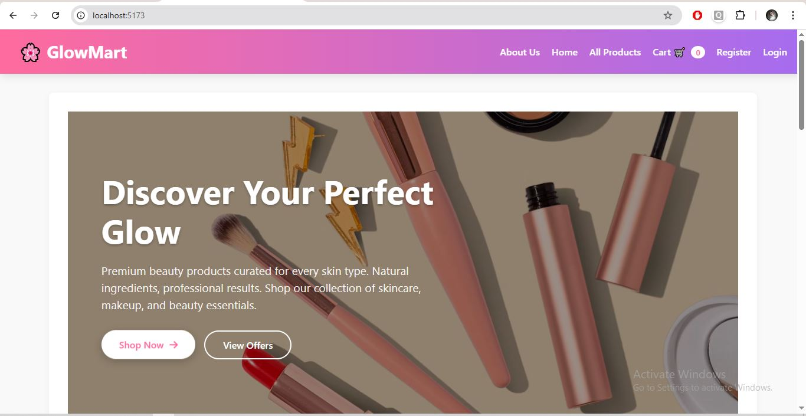
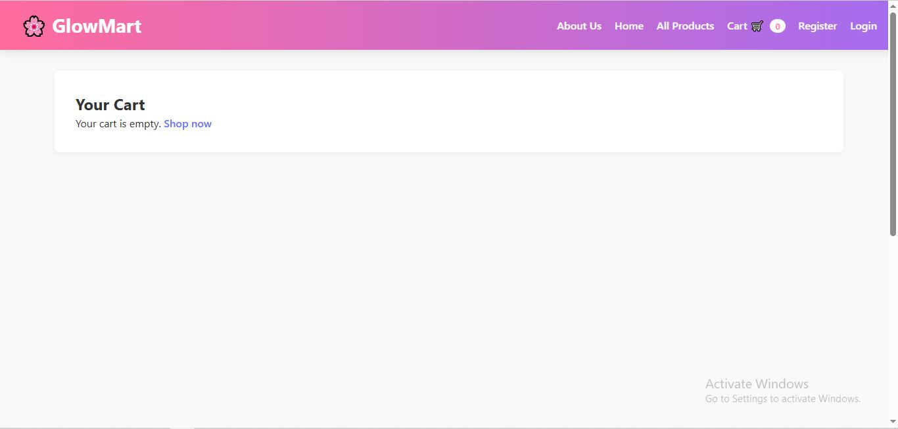
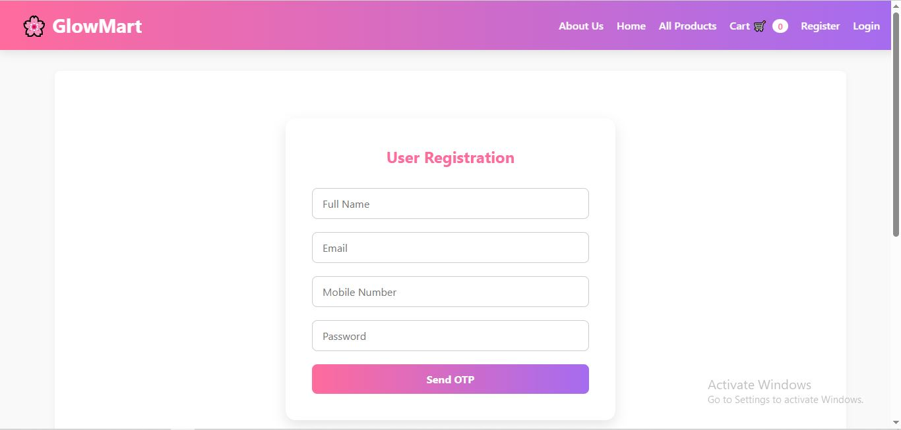
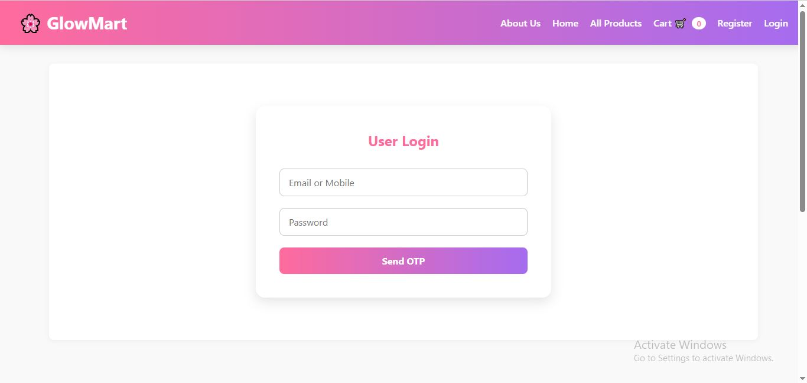

# 💄 GlowMart - Smart Beauty E-Commerce Web App

An end-to-end full-stack web application for buying beauty and skincare products with OTP-based authentication and personalized order tracking.

---

## 🚀 Tech Stack

| Frontend               | Backend                 | Database        |
|------------------------|--------------------------|------------------|
| React.js (Vite)        | Spring Boot (Java)       | H2 (in-memory)   |
| Tailwind CSS + Custom CSS | Spring Data JPA / Hibernate |              |
| React Router DOM       | RESTful APIs             |                 |

---

## ✨ Features

### 🛍️ Frontend
- Browse products by category (Skincare, Makeup, etc.)
- Add to cart + remove + clear cart
- Checkout with OTP verification
- Registration with password + OTP verification
- Login with OTP verification
- View "My Orders" dashboard
- Fully responsive layout
- Session-based login

### 🔐 Backend
- Register users with email, mobile, password
- Send and verify OTP via email
- Store cart and order details in database
- Fetch orders for each user
- Prevent guest users from placing orders

---

## 🧾 Authentication Flow

1. **User Registration**  
   - Enter name, email, mobile, password  
   - Get OTP on email → Verify OTP → Register

2. **Login**  
   - Enter email or mobile + password  
   - Get OTP → Verify OTP → Login

3. **Checkout Protection**  
   - Guest users redirected to registration  
   - Only logged-in users can place orders

---

## 📂 Folder Structure

<details>
<summary>Click to Expand</summary>

```bash
/glowmart-frontend
  ├── /components         # Header, Footer, Layout, HeroBanner, etc.
  ├── /pages              # Home.jsx, Products.jsx, Register.jsx, Login.jsx, Checkout.jsx, MyOrders.jsx
  ├── /context            # CartContext.jsx
  ├── /styles             # style.css
  └── App.jsx             # Main Router

/glowmart-backend
  ├── /controller         # AuthController, OrderController, OtpController
  ├── /entity             # Customer.java, Order.java, OrderItem.java, UserCredential.java
  ├── /repository         # CustomerRepository, OrderRepository, UserCredentialRepository
  ├── /dto                # LoginRequest, OrderRequest, CustomerDto, ItemDto
  ├── /service            # OtpService.java
  └── GlowmartApplication.java

```
</details>

---


## 🛠 Setup & Run Locally

### 🔧 Backend (Spring Boot)


cd glowmart-backend
mvn spring-boot:run

## 💡 Features

- 🛒 Add to Cart & Quantity Management  
- 👤 Register & Login with OTP  
- 📦 Checkout with OTP/email verification  
- 📄 My Orders Page for Order Summary  
- 🔐 Session-based Auth using `sessionStorage`  
- 💅 Responsive & Clean UI  

---

## 🛠️ How to Run the Project

### 1. Backend (Spring Boot)

```bash
cd glowmart-backend
./mvnw spring-boot:run
```

#### Make sure you have:

- Java 17+
- Maven (or wrapper included)
- Runs on: http://localhost:8080

### 2. Frontend (React)
  ```bash
   cd glowmart-frontend
   npm install
   npm run dev
  ``` 
- Runs on: http://localhost:5173

---

---

## **Complete Detailed Guide to Run from Sratch**

[Developer setup Guide](./setup_instructions.md)

---

---

# 🧩 Database Overview for GlowMart

This document outlines the **tables**, **relationships**, and **how to access/view data** in the H2 in-memory database used in the GlowMart Fullstack Project.

---

## 📋 Tables Created

When the backend runs, Spring Boot + JPA auto-generates the following tables:

| Table Name         | Description                                 | Relationships                                            |
| ------------------ | ------------------------------------------- | -------------------------------------------------------- |
| `user_credentials` | Stores login info (email/mobile + password) | 1-to-1 with `user_details`                               |
| `user_details`     | Stores user personal info                   | 1-to-1 with `user_credentials`                           |
| `products`         | Product catalog                             | Independent                                              |
| `customer`         | Checkout user address                       | 1-to-many with `orders`                                  |
| `orders`           | Stores order summary                        | Many-to-one with `customer`, 1-to-many with `order_item` |
| `order_item`       | Stores each product in an order             | Many-to-one with `orders`                                |

> 🔄 `user_credentials` & `user_details` are created at registration. `customer`, `orders`, and `order_item` are created when a user places an order.

---

## 🔍 How to Access the H2 Console

To inspect the database (view tables, run queries):

### ✅ Step-by-step:

1. Make sure the **backend server is running** using:

   ```bash
   ./mvnw spring-boot:run
   ```

2. Open your browser and navigate to:

   ```
   http://localhost:8080/h2-console
   ```

3. Use the following credentials:

| Field     | Value                |
| --------- | -------------------- |
| JDBC URL  | `jdbc:h2:mem:glowmartdb` |
| User Name | `sa`                 |
| Password  | *(leave blank)*      |
```html
Note : Take details as per your configuration in backend application.properties
```
4. Click **Connect**.

5. You’ll now see all tables in the left sidebar.

---

## 🧪 Sample SQL Queries

Use the console to run queries like:

```sql
-- View all users
SELECT * FROM user_details;
SELECT * FROM user_credentials;

-- View products
SELECT * FROM products;

-- View all orders
SELECT * FROM orders;
SELECT * FROM order_item;
SELECT * FROM customer;

-- Delete all data (for testing reset)
DELETE FROM order_item;
DELETE FROM orders;
DELETE FROM customer;
```

> ⚠️ Note: Delete queries must respect foreign key constraints. You may need to delete `order_item` before `orders`, and `orders` before `customer`.

---

## 🔗 Optional Enhancements

- Export data from the H2 console.
- Add SQL migration scripts with Flyway or Liquibase.
- Switch to MySQL/PostgreSQL in production environments.

---
## ✅ Test Scenarios
- Add multiple products to cart
- Try ordering without login → should redirect to registration
- Register → OTP → Checkout → Order
- Login → Go to My Orders → See placed orders
- Logout → Cart resets, protected pages inaccessible

---

## 🔐 Auth Flow Summary
- OTP-based email/mobile verification during registration & login
- User data stored in sessionStorage
- Backend validates orders only for logged-in users

---

## 📸 Screenshots

- Homepage
  


- Cart
  


- Register Form
  


- Login Form
  

---

## 🚀 Usage

- 🛍️ Browse a wide range of beauty and skincare products by category
- ➕ Add products to cart and manage quantity
- 🔐 Register or Login via OTP (email/mobile) verification
- 🧾 Place orders after verifying details
- 📋 View your past orders from “My Orders” section
- 🔓 Logout clears session and protects routes
- 💻 Fully responsive for desktop and mobile devices

---

## 🔮 Future Enhancements

- 🗺️ **Google Maps Address Autofill**  
  Automatically fetch user location using Google Maps API at checkout to avoid manual address entry.

- 💳 **Online Payment Integration**  
  Add payment gateway support (e.g., Razorpay, Stripe) for secure prepaid transactions.

- 🔐 **JWT Authentication**  
  Secure backend APIs and session handling using JWT tokens for better protection.

- 📦 **Order Status Tracking**  
  Allow users to see order progress like "Processing", "Shipped", and "Delivered".

- 🧾 **Downloadable PDF Invoice**  
  Generate and provide downloadable invoice PDFs after each order.

- 📱 **React Native App (Mobile version)**  
  Future plan to develop a mobile app version for Android & iOS users.

---

## Contributing

### Contributions are welcome! Please fork the repository and submit a pull request.

---

## License

This document is part of the [GlowMart Fullstack App](https://github.com/Rdf1846/glowmart-fullstack.git) — MIT Licensed.
see the [LICENSE](LICENSE) file for details.

---

## Contact

For any inquiries or support, please contact:
- **Name**: Rahul Kasana
- **Email**: rahulkasana1846@gmail.com
- **LinkedIn**: [LinkedIn](https://linkedin.com/in/your-profile)
- **Location**: Ghaziabad, Uttar Pradesh

---

Happy Shopping!